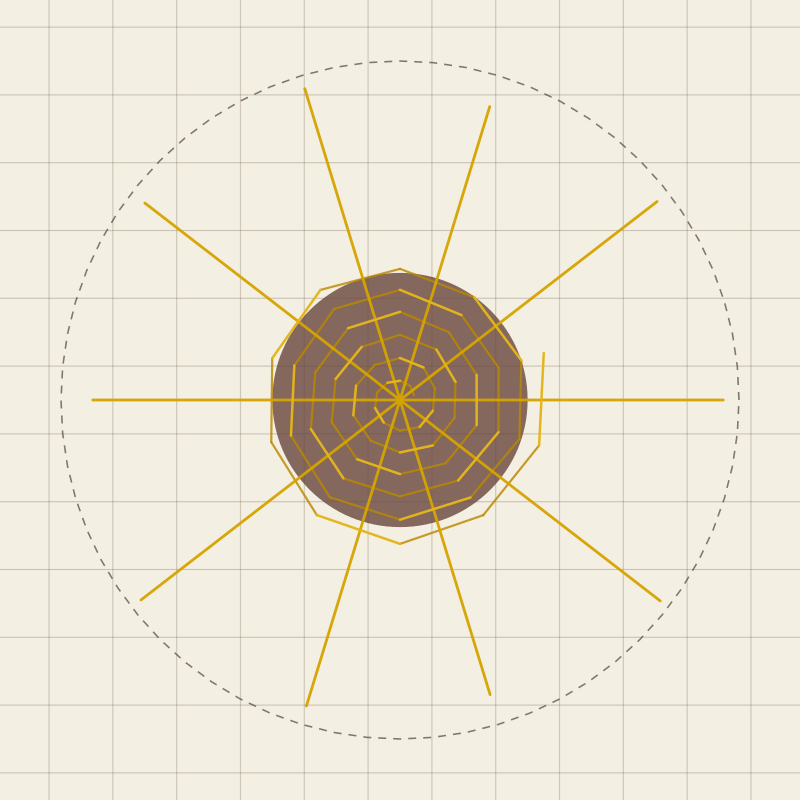

# Traditional star darn: visual selection and implementation



The pattern was selected visually before the JavaScript model was ported to Rust. The comparison was specifically intended to avoid a rectangular warp/weft darn merely cut into a star silhouette.

## References compared

- Hikaru Noguchi's published darning examples show repairs built from radial foundation threads and a compact worked centre rather than orthogonal rows.
- A photographed Japanese workshop repair shows a clear radial web: anchored rays around the perimeter with a woven centre.
- The repair-specific woven-wheel instructions from Alleyhats begin with eight radial stitches, then work under two threads and back over one around each spoke.
- The Royal School of Needlework's StitchBank distinguishes the woven wheel and whipped wheel, both constructed from a radial foundation and a second thread worked around the spokes.
- The Mother Earth News “woven star patch” uses parallel warp/weft rows inside a star outline. That is a valid decorative repair, but it is the mechanical left/right construction rejected for this exhibit.

Sources:

- <https://shopbeyondmeasure.co.uk/products/beyond-darning-by-hikaru-noguchi>
- <https://www.alleyhats.co.uk/notebook/lockdown-diy-project>
- <https://rsnstitchbank.org/stitch/woven-wheel-stitch>
- <https://rsnstitchbank.org/stitch/whipped-wheel>
- <https://ameblo.jp/yo-so-terumi/entry-12763732300.html>
- <https://www.motherearthnews.com/homesteading-and-livestock/star-patch-darning-ze0z1207zwar>

No reference image is copied into the repository.

## Rust geometry

`generate_star_darn` emits three mechanically visible families:

1. radial foundation spokes, sized automatically from the hole and thread pitch;
2. under-passes of one continuous expanding spiral;
3. over-passes of that same spiral.

The centre follows the repair-specific under-two/back-over-one cadence. Under-passes are rendered first, then spokes, then over-passes, so the canvas communicates the actual interlacing rather than drawing a flat spiderweb. Small deterministic changes in spoke reach and spiral radius prevent the motif from reading as machine-perfect while keeping simulations repeatable.

The woven centre extends just beyond the hole edge; spoke anchors extend into sound material and are clipped to the selected repair perimeter. The mechanics solver receives the same segment families that are drawn.

## Reproducing the preview

```sh
cargo run --release --bin darning-render -- \
  --pattern star \
  --damage hole \
  --geometry-only true \
  --output docs/star-darn-preview.svg
```
